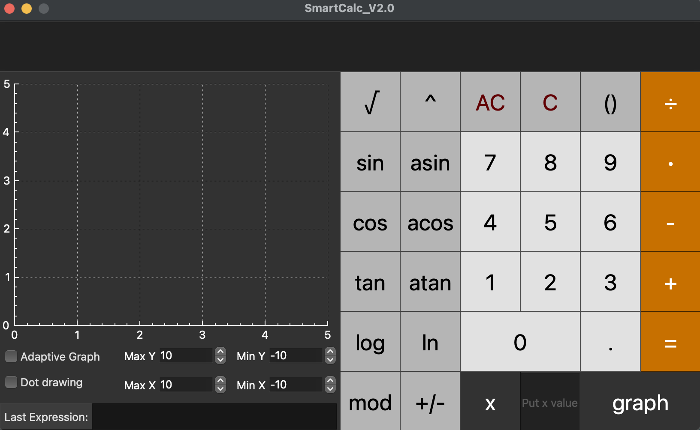

## SmartCalc_V2.0
### made by Julieanb

- This is the second version of the educational project "SmartCalc". Written in C++ using MVC in QT.

- The calculator is able to process expressions of any complexity.

- The expression can be entered directly into the line, or using the buttons.

- The length of the entered expression is limited to 255 characters.

After the expression is calculated, 
the expression itself flies into the Last expression block. 
When you click on the button, 
you will return the previously entered expression to the input line.