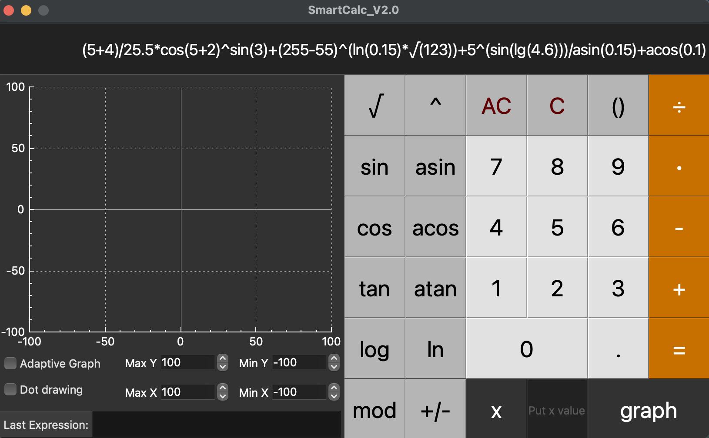
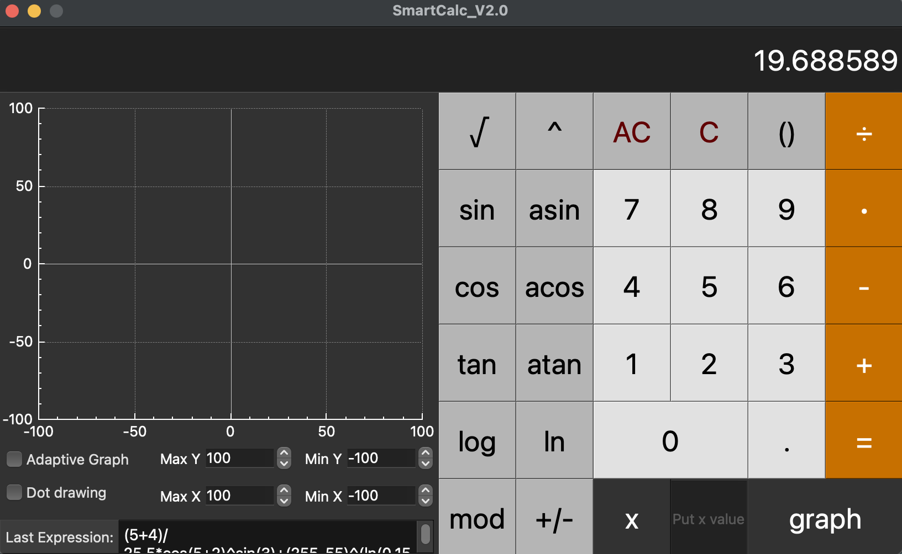

## SmartCalc_V2.0
### made by Julieanb

- This is the second version of the educational project "SmartCalc". Written in C++ using MVC in QT.

- The calculator is able to process expressions of any complexity.

- The expression can be entered directly into the line, or using the buttons.

- The length of the entered expression is limited to 255 characters.

- To install the application, you need to complete the Makefile install goal. 
Afterwards, the executable will be in src/build. You need QT Framework to work correctly.

## Makefile targets

- all: Collects model tests and checks coverage.

- test: Gathers only model tests using gtest.

- gcov_report: Collects model coverage tests. You need gcov/lcov to work.

- install: Installs the application and generates an executable file in the build folder.

- dvi: Generates project technical documentation using doxygen. 
The documentation is initially in the repository, 
you can view it by opening src/documentation/html/index.html, 
or by executing the open makefile target.

- dist: Executes the Makefile install target, then archives the executable.

- clean: Removes files generated after the test and gcov_report targets.

- cleanall: Clears all generated files, bringing the repository to its original state.

After the expression is calculated, 
the expression itself flies into the Last expression block. 
When you click on the button, 
you will return the previously entered expression to the input line.